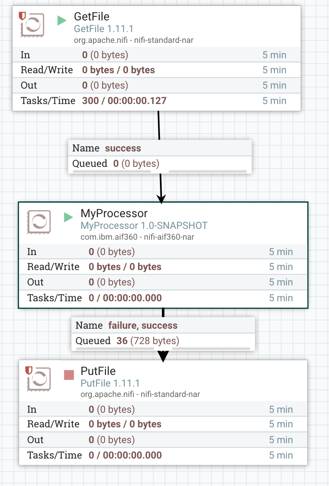

# Apache Nifi Custom Processor for AIF360

The Apache Nifi Custom Processor for AIF360 is an implementation of Apache Nifi Custom Processor. The processor takes
a [flowfile](https://nifi.apache.org/docs/nifi-docs/html/user-guide.html#terminology)
as input and adds fairness metrics attributes to the flowfile as output.

**Example: AIF360 Components**
* [Generic Processor](generic-processor)

The Generic Processor can be compiled using the following command:

`mvn clean install`

The *target/nifi-aif360-nar-1.0-SNAPSHOT.nar* needs to be copied to $NIFI_HOME/lib/. After a restart of NIFI it is available in the pallet and can be drag and dropped to the canvas.

Alternatively, the nifi-aif360-nar-1.0-SNAPSHOT.nar can be pulled from the [here](generic-processor/nifi-aif360-nar/target).

Currently, the Generic Processor expects the flowfile in headerless CSV format, separated by comma. Other configurations can be supported without problem in future releases.

The [Example Flow](examples/flow.xml.gz) is shown below and can be imported by copying it to $NIFO_HOME/conf/

